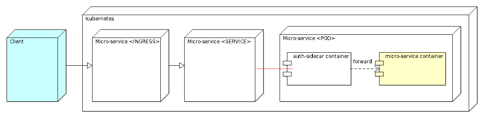
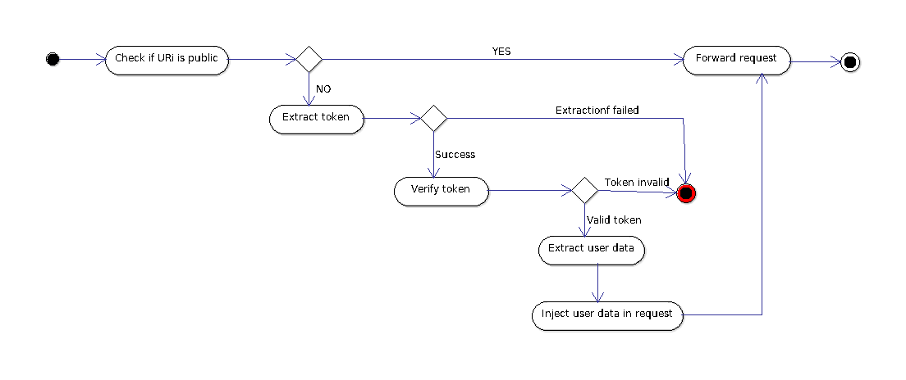
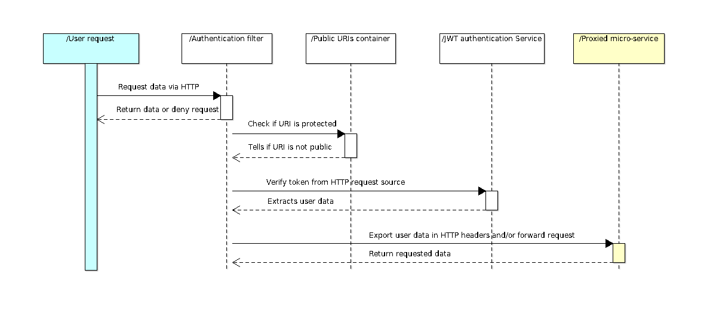
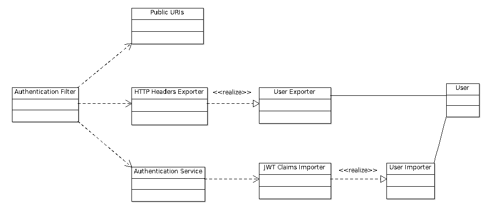

# TL;DR;

The design is minimal and incomplete on purpose, **so is the code too**. Things would evolve around discussions, requirements changes, issues, etc.

# Rationale

# Scope
This project contains is a proxy for granting access to a micro-service via [JWT token authentication](https://jwt.io/introduction/).

- It is intended to be deployed as a [sidecar](https://docs.microsoft.com/en-us/azure/architecture/patterns/sidecar) [POD](https://kubernetes.io/docs/concepts/workloads/pods/pod/) on [Kubernetes](https://kubernetes.io/) as the facing [SERVICE](https://kubernetes.io/docs/concepts/services-networking/service/) of a micro-service app. However, there's no dependency against Kubernetes.
- Java packages are organized around the [Entity-Control-Boundary pattern](http://www.cs.sjsu.edu/faculty/pearce/modules/patterns/enterprise/ecb/ecb.htm).

# Main functionality

The "Client/UI" authenticates the user against an IDP (Identity Provider-Oauth2) and then request data from a micro-service. Some "known urls" of the micro-service are to be protected from malicious access via JWT token authentication.

# Solution design

# Deployment view

The public facing Kubernetes "Service" of the micro-service would be connected to the sidecar (**instead of the micro-service** container itself).

- The configuration is to be specified in a [Kubernetes "DEPLOYMENT"](https://kubernetes.io/docs/concepts/workloads/controllers/deployment/) YAML descriptor.
- The sidecar runs within an embedded [Jetty](https://www.eclipse.org/jetty/) server. It initializes its configuration from environment variables injected in a Kubernetes "DEPLOYMENT".

## Process view

No authentication is performed against public URIs:

- If the URI is protected, the request must contain a valid JWT token with expected claims. 
- Once the claims are extracted, user data is injected in the request and forwarded to the proxied micro-service.

# Detailed design

## Main software libraries

### Runtime dependencies

Embedded [Jetty](https://www.eclipse.org/jetty/) as app server, [Nimbuds JOSE+JWT](https://connect2id.com/products/nimbus-jose-jwt) for JWT matters, [Mitre Proxy servlet](https://github.com/mitre/HTTP-Proxy-Servlet)

### Test dependencies

Hamcrest, Junit and JMockit 

## Components collaboration

The business logic is just driven by a [servlet](https://en.wikipedia.org/wiki/Java_servlet) filter that relies on a "public URIs container" and a JWT authentication service. Additional sub-components and abstractions are left to the discretion of the implementer.

## Class diagram

Please find below the core classes.

